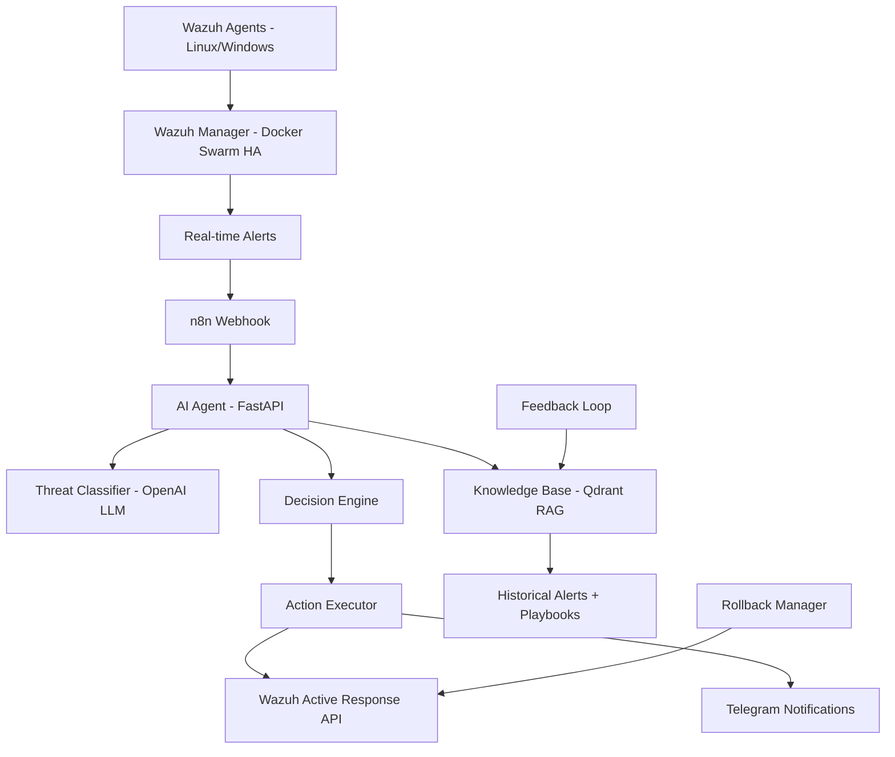

# Wazuh AI Agent - Intelligent SIEM Automation

> Custom AI Agent for Wazuh SIEM that monitors, classifies, and automatically responds to security threats.

## Overview

This project implements a full-stack AI-powered security automation system for Wazuh SIEM. The AI Agent continuously monitors Wazuh alerts, classifies threats using LLM-based analysis, retrieves relevant playbooks from a vector knowledge base (Qdrant), and executes automated active responses — all while notifying the security team via Telegram.

## Architecture



## Infrastructure

| Component | Details |
|-----------|---------|
| Wazuh SIEM | 3 VMs, Docker Swarm HA (Proxmox) |
| Integrations | PSTool, Suricata, Sysmon |
| Workflow Engine | n8n (n8n.y3kh.dpdns.org) |
| Vector Database | Qdrant |
| AI Model | OpenAI GPT-4o-mini |
| Notifications | Telegram Bot |
| Access | Cloudflare Tunnel |

## Project Structure

```
wazuh-ai-agent/
├── README.md                          # This file
├── phase1-rules-decoders/             # Custom Wazuh rules & decoders
│   ├── rules/
│   │   ├── unwanted_sw.xml            # PSTool rules
│   │   ├── suricata_custom.xml        # Suricata IDS rules
│   │   └── sysmon_custom.xml          # Sysmon monitoring rules
│   ├── decoders/
│   │   └── custom_decoders.xml        # Custom log decoders
│   └── MITRE_ATTACK_COVERAGE.md       # MITRE ATT&CK mapping
├── phase2-webhook-integration/        # Wazuh → n8n → AI Agent pipeline
│   ├── ossec_integration_config.xml   # Wazuh integration config
│   ├── custom-n8n.py                  # Alert forwarding script
│   ├── n8n_wazuh_webhook_workflow.json # n8n workflow (import this)
│   ├── alert_enrichment.py            # GeoIP/VirusTotal enrichment
│   ├── qdrant_setup.py                # Qdrant collection setup
│   └── README.md
├── phase3-ai-agent-core/              # AI Agent application
│   ├── ai_agent/
│   │   ├── __init__.py
│   │   ├── main.py                    # FastAPI server
│   │   ├── classifier.py             # LLM threat classifier
│   │   ├── knowledge_base.py         # Qdrant RAG
│   │   ├── decision_engine.py        # Response decision logic
│   │   ├── action_executor.py        # Wazuh API + Telegram
│   │   ├── models.py                 # Pydantic data models
│   │   └── config.py                 # Configuration
│   ├── Dockerfile
│   ├── docker-compose.yml
│   └── requirements.txt
├── phase4-active-response/            # Active response scripts
│   ├── linux/
│   │   ├── ai-isolate.sh             # Host isolation
│   │   ├── ai-block-ip.sh            # IP blocking
│   │   ├── ai-kill-process.sh        # Process termination
│   │   ├── ai-disable-user.sh        # User account disable
│   │   ├── ai-collect-forensics.sh   # Evidence collection
│   │   ├── ai-unblock-ip.sh          # Rollback: unblock IP
│   │   └── ai-unisolate.sh           # Rollback: restore network
│   ├── windows/
│   │   ├── ai-isolate.ps1
│   │   ├── ai-block-ip.ps1
│   │   ├── ai-kill-process.ps1
│   │   └── ai-collect-forensics.ps1
│   ├── ossec_ar_config.xml            # Wazuh AR configuration
│   ├── n8n_active_response_workflow.json
│   └── rollback_manager.py           # Action tracking + auto-rollback
├── phase5-training/                   # Training & fine-tuning
│   ├── training_data_collector.py     # Export historical alerts
│   ├── data_labeler.py               # Auto-label + manual override
│   ├── training_pipeline.py          # Model training + evaluation
│   ├── feedback_loop.py              # Analyst feedback API
│   ├── test_simulator.py             # Attack simulation testing
│   └── README.md
└── phase6-production/                 # Production deployment
    ├── docker-compose.production.yml  # Full production stack
    ├── .env.example                   # Environment variables template
    ├── deploy.sh                      # One-command deployment
    ├── Dockerfile.feedback
    ├── requirements.txt
    └── monitoring/
        └── health_check.py            # Health + Prometheus metrics
```

## Setup Guide

### Prerequisites

- Docker & Docker Compose installed
- Wazuh SIEM running with API enabled
- Python 3.9+
- OpenAI API key
- Telegram Bot token
- n8n instance running

### Step 1: Clone Repository

```bash
git clone git@github.com:yekyawhan/wazuh-ai-agent.git
cd wazuh-ai-agent
```

### Step 2: Deploy Wazuh Rules & Decoders (Phase 1)

```bash
# Copy rules to Wazuh Manager
sudo cp phase1-rules-decoders/rules/*.xml /var/ossec/etc/rules/
sudo cp phase1-rules-decoders/decoders/custom_decoders.xml /var/ossec/etc/decoders/

# Test rules
sudo /var/ossec/bin/wazuh-logtest

# Restart Wazuh Manager
sudo systemctl restart wazuh-manager
```

### Step 3: Configure Webhook Integration (Phase 2)

```bash
# Copy integration script to Wazuh
sudo cp phase2-webhook-integration/custom-n8n.py /var/ossec/integrations/
sudo chmod 750 /var/ossec/integrations/custom-n8n.py
sudo chown root:wazuh /var/ossec/integrations/custom-n8n.py

# Add integration config to ossec.conf
# Copy content from phase2-webhook-integration/ossec_integration_config.xml
# into /var/ossec/etc/ossec.conf (inside <ossec_config> block)

# Import n8n workflow
# Open n8n panel → Import → Upload phase2-webhook-integration/n8n_wazuh_webhook_workflow.json

# Setup Qdrant collections
cd phase2-webhook-integration
pip install qdrant-client openai
python qdrant_setup.py

# Restart Wazuh
sudo systemctl restart wazuh-manager
```

### Step 4: Deploy AI Agent (Phase 3)

```bash
cd phase3-ai-agent-core

# Create .env file
cat > .env << EOF
OPENAI_API_KEY=your_openai_api_key
OPENAI_MODEL=gpt-4o-mini
OPENAI_EMBEDDING_MODEL=text-embedding-ada-002
QDRANT_HOST=qdrant
QDRANT_PORT=6333
WAZUH_API_URL=https://your-wazuh-manager:55000
WAZUH_API_USER=wazuh-wui
WAZUH_API_PASSWORD=your_password
TELEGRAM_BOT_TOKEN=your_bot_token
TELEGRAM_CHAT_ID=1721493612
EOF

# Deploy with Docker
docker-compose up -d

# Verify
curl http://localhost:8000/status
```

### Step 5: Install Active Response Scripts (Phase 4)

```bash
# Linux agents
sudo cp phase4-active-response/linux/*.sh /var/ossec/active-response/bin/
sudo chmod +x /var/ossec/active-response/bin/ai-*.sh
sudo chown root:wazuh /var/ossec/active-response/bin/ai-*.sh

# Windows agents (copy to each Windows agent)
# Copy phase4-active-response/windows/*.ps1 to:
# C:\Program Files (x86)\ossec-agent\active-response\bin\

# Add AR config to ossec.conf
# Copy content from phase4-active-response/ossec_ar_config.xml
# into /var/ossec/etc/ossec.conf

# Deploy rollback manager
cd phase4-active-response
pip install fastapi uvicorn httpx
python rollback_manager.py &

# Import n8n AR workflow
# Upload phase4-active-response/n8n_active_response_workflow.json to n8n

# Restart Wazuh
sudo systemctl restart wazuh-manager
```

### Step 6: Train the AI Agent (Phase 5)

```bash
cd phase5-training

# Install dependencies
pip install openai qdrant-client httpx

# 1. Collect historical alerts from Wazuh
python training_data_collector.py --days 90 --min-level 5

# 2. Auto-label alerts
python data_labeler.py --input alerts_export.jsonl --output labeled_alerts.jsonl

# 3. Run training pipeline (populate knowledge base)
python training_pipeline.py --input labeled_alerts.jsonl

# 4. Test with simulated attacks
python test_simulator.py --scenarios all --report test_report.json
```

### Step 7: Production Deployment (Phase 6)

```bash
cd phase6-production

# Configure environment
cp .env.example .env
# Edit .env with your production values

# Deploy everything
chmod +x deploy.sh
./deploy.sh

# Verify all services
curl http://localhost:8000/status   # AI Agent
curl http://localhost:6333/health   # Qdrant
curl http://localhost:8001/metrics  # Feedback Loop
curl http://localhost:9090          # Prometheus
```

## API Reference

### AI Agent (Port 8000)

| Endpoint | Method | Description |
|----------|--------|-------------|
| `/analyze` | POST | Analyze a Wazuh alert |
| `/status` | GET | Agent health status |
| `/stats` | GET | Processing statistics |

### Feedback Loop (Port 8001)

| Endpoint | Method | Description |
|----------|--------|-------------|
| `/feedback` | POST | Submit analyst feedback |
| `/metrics` | GET | Performance metrics |

### Rollback Manager (Port 8002)

| Endpoint | Method | Description |
|----------|--------|-------------|
| `/rollback/{action_id}` | POST | Rollback a specific action |
| `/actions` | GET | List all executed actions |

## Alert Processing Flow

1. **Wazuh** detects security event → generates alert
2. **Integration script** forwards alert to n8n webhook
3. **n8n** routes alert to AI Agent API
4. **AI Classifier** analyzes alert using GPT-4o-mini
5. **Knowledge Base** retrieves similar past incidents + matching playbooks
6. **Decision Engine** determines response (AUTO / RECOMMEND / ALERT_ONLY)
7. **Action Executor** triggers Wazuh Active Response or sends approval request
8. **Telegram** notifies admin of all actions taken
9. **Rollback Manager** tracks actions for potential reversal

## Security Considerations

- All API endpoints should be secured with authentication in production
- Use Docker Secrets for sensitive credentials
- Restrict network access to AI Agent services
- Enable TLS for all inter-service communication
- Implement rate limiting on API endpoints
- Regular security audits of active response scripts
- Test rollback procedures regularly

## Troubleshooting

| Issue | Solution |
|-------|----------|
| AI Agent not responding | Check Docker logs: `docker logs ai-agent` |
| Wazuh API auth fails | Verify credentials in .env, check Wazuh API status |
| Telegram not sending | Verify bot token and chat ID, ensure bot is started |
| Qdrant connection error | Check Qdrant container status, verify host/port |
| Active response not triggering | Check ossec.conf AR config, verify script permissions |
| High false positive rate | Increase AUTO_ACTION_CONFIDENCE_THRESHOLD in .env |

## License

Private - Internal Use Only
